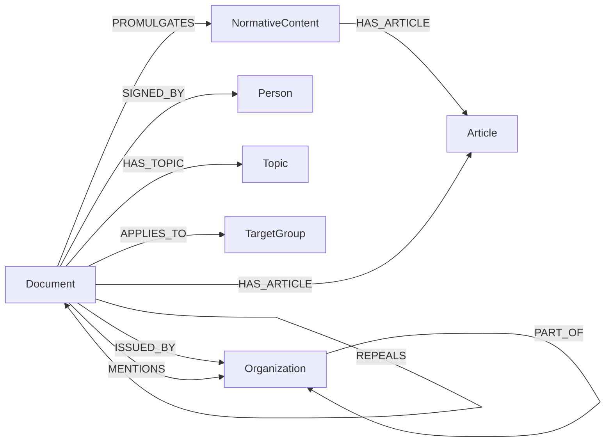
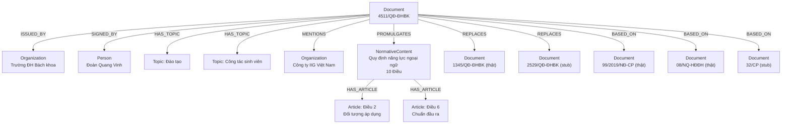

# Báo cáo đồ thị tri thức pháp chế quản trị đại học

Báo cáo mô tả **đồ thị Neo4j** của `legal_knowledge_graph`: schema thực
tế trong database, số liệu hiện có, hiệu năng truy vấn, và các vấn đề
chất lượng dữ liệu đã ghi nhận. Không lặp lại nội dung đã có ở nơi khác:
tổng quan dự án và kiến trúc ứng dụng xem `README.md`, định dạng file
JSON đầu vào xem `STRUCTUREDFORM.md`, ví dụ Cypher theo tình huống xem
`EXAMPLE.md`.

Domain: văn bản pháp quy trong quản trị đại học — nội quy/quy định/quy
chế nội bộ của Trường Đại học Bách khoa & Đại học Đà Nẵng, cộng văn bản
cấp Bộ/Chính phủ/Quốc hội mà các văn bản nội bộ viện dẫn làm căn cứ. Đồ
thị được xây bằng gán tay (JSON → graph), không trích xuất tự động, để
đảm bảo độ chính xác của quan hệ hiệu lực (`REPLACES`/`AMENDS`/`REPEALS`)
— nhóm quan hệ khó trích đúng bằng regex/NLP.

**Mục lục:** [1. Schema](#1-schema-đồ-thị) · [2. Ví dụ thực tế](#2-ví-dụ-đồ-thị-con-thực-tế)
· [3. Số liệu](#3-số-liệu-hiện-tại) · [4. Benchmark](#4-benchmark-hiệu-năng)
· [5. Vấn đề dữ liệu](#5-vấn-đề-dữ-liệu-đã-biết)

---

## 1. Schema đồ thị

7 node label, 13 relationship type — trích trực tiếp từ
`core/graph_loader.py`/`core/graph_model.py`.

### 1.1 Node

| Node | Identifier | Properties chính | Ghi chú |
|---|---|---|---|
| `Document` | `normalizedNumber` | `documentNumber, title, documentType, status, issueDate, effectiveDate, expiryDate, summary, authorityLevel, isStub` | Node trung tâm. Bản "thật" (`isStub:false`) có đủ property; bản "stub" (bị trích dẫn nhưng chưa có JSON riêng) chỉ có 3 property (`normalizedNumber, documentNumber, isStub:true`). |
| `Organization` | `orgId` | `name, orgType` | `orgType` (1/8 giá trị chuẩn) dùng để suy `authorityLevel` của Document và dựng cây `PART_OF`. |
| `Person` | `personId` | `fullName, academicTitle, position[]` | `position` gộp mọi chức danh đã ghi nhận qua các lần ký. |
| `Topic` | `topicId` | `name` | 18 lĩnh vực cố định, `reference/topics_seed.json`. |
| `TargetGroup` | `targetGroupId` | `name` | 8 nhóm đối tượng áp dụng, `reference/target_groups_seed.json`. |
| `NormativeContent` | `contentId` | `title, contentType, status` | Nội dung "ban hành kèm theo" một Document (Quy định/Quy chế/Nội quy...); `status` mặc định kế thừa Document cha nếu không ghi riêng. |
| `Article` | `articleId` | `number, heading, text, isImplementationClause` | `text` là toàn văn một Điều, đối tượng của full-text index `article_text`. |

Document và Article tách riêng vì đơn vị truy vấn khác nhau (toàn văn bản
vs một Điều cụ thể). NormativeContent là tầng trung gian vì văn bản pháp
quy Việt Nam thường có dạng "Quyết định ban hành kèm theo Quy định" — bản
thân Quyết định chỉ có 2-3 Điều thủ tục, nội dung chính nằm ở Quy định
kèm theo. Organization tách khỏi Document (thay vì lưu như một chuỗi
thuộc tính) để dựng được cây tổ chức và suy `authorityLevel` theo loại cơ
quan. Topic/TargetGroup là node phân loại tách riêng để một văn bản gắn
được nhiều giá trị cùng lúc.

### 1.2 Relationship

| Relationship | From → To | Ý nghĩa |
|---|---|---|
| `ISSUED_BY` | Document → Organization | Cơ quan đứng tên ban hành. |
| `SIGNED_BY` | Document → Person | Người ký — tách khỏi `ISSUED_BY` vì một cơ quan có nhiều người có thẩm quyền ký theo từng thời kỳ. |
| `HAS_TOPIC` | Document → Topic | Lĩnh vực nghiệp vụ (nhiều-nhiều). |
| `APPLIES_TO` | Document → TargetGroup | Nhóm đối tượng áp dụng (nhiều-nhiều). |
| `MENTIONS` | Document → Organization | Tổ chức được nhắc tới trong thân văn bản, không phải bên ban hành/ký. |
| `PART_OF` | Organization → Organization | Cấp dưới → cấp trên trực tiếp (Phòng/Ban → Trường thành viên → Đại học vùng). |
| `PROMULGATES` | Document → NormativeContent | Văn bản "ban hành kèm theo" một Quy định/Quy chế. |
| `HAS_ARTICLE` | Document → Article **hoặc** NormativeContent → Article | Chứa một Điều — nhánh Document dùng cho Điều "vỏ bọc" (Điều 1/2/3 thủ tục), nhánh NormativeContent dùng cho Điều nội dung; hai nhánh tồn tại đồng thời trên cùng một Document là trường hợp phổ biến, không phải ngoại lệ. |
| `BASED_ON` | Document → Document | Căn cứ pháp lý — không hàm ý bên bị trỏ tới mất hiệu lực. |
| `REFERENCES` | Document → Document | Nhắc tới thông thường, không rơi vào 4 loại quan hệ hiệu lực còn lại. |
| `REPLACES` | Document → Document | Thay thế toàn bộ — bên bị trỏ tới hết hiệu lực thực tế. |
| `AMENDS` | Document → Document | Sửa đổi một phần, bên bị trỏ tới vẫn còn hiệu lực tổng thể; có thể kèm `targetArticle` (chuỗi mô tả, không resolve thành cạnh tới node `Article` — xem §5). |
| `REPEALS` | Document → Document | Bãi bỏ — khác `REPLACES` ở chỗ không có văn bản thay thế nội dung. |

5 loại quan hệ hiệu lực/trích dẫn (`BASED_ON`/`REFERENCES`/`REPLACES`/
`AMENDS`/`REPEALS`) tách riêng thay vì gộp một loại chung vì mỗi loại đòi
hỏi xử lý khác nhau khi trả lời "văn bản này còn hiệu lực không":
`BASED_ON`/`REFERENCES` không ảnh hưởng hiệu lực bên bị trỏ tới,
`REPLACES`/`REPEALS` chấm dứt hiệu lực, `AMENDS` chỉ thay đổi một phần —
gộp chung sẽ không viết được truy vấn đúng cho câu hỏi pháp lý thực tế.

### 1.3 Ba dạng phân cấp

- **Nội dung văn bản:** `Document -[PROMULGATES]-> NormativeContent
  -[HAS_ARTICLE]-> Article`, song song với `Document -[HAS_ARTICLE]->
  Article` cho Điều vỏ bọc hoặc văn bản không có nội dung kèm theo.
- **Tổ chức:** `Organization -[PART_OF]-> Organization`, 20 cạnh trên dữ
  liệu hiện có.
- **Thẩm quyền (thuộc tính, không phải cấu trúc node):** `authorityLevel`
  (1–6, `core/normalize.py` tự suy từ loại cơ quan rồi tới loại văn bản)
  — Hiến pháp=6, Luật=5, Nghị định=4, Thông tư=3, Đại học vùng=2, trường
  thành viên=1.



---

## 2. Ví dụ đồ thị con thực tế

Văn bản **`4511/QĐ-ĐHBK`** — Quyết định ban hành Quy định về yêu cầu năng
lực ngoại ngữ đối với sinh viên Trường Đại học Bách khoa — lấy trực tiếp
từ database.

| Property | Giá trị |
|---|---|
| `documentType` | Quyết định |
| `status` | CON_HIEU_LUC |
| `issueDate` | 2022-11-22 |
| `authorityLevel` | 1 (cấp trường thành viên) |

Văn bản này minh hoạ gần đủ các loại quan hệ trong schema: 1
`ISSUED_BY`, 1 `SIGNED_BY`, 2 `HAS_TOPIC` (Đào tạo, Công tác sinh viên), 5
`MENTIONS` (trong đó có "Công ty IIG Việt Nam" — đơn vị tổ chức thi
TOEIC, được nhắc tới nhưng không ban hành/ký), 1 `PROMULGATES` tới một
NormativeContent 10 Điều, 3 Điều vỏ bọc cấp Document, và 6 cạnh
`REPLACES` + 9 cạnh `BASED_ON` — bản cập nhật thứ 6 của một chính sách
tồn tại từ 2016.



Chuỗi `REPLACES` cho thấy 4511/QĐ-ĐHBK thay thế trực tiếp 1345/QĐ-ĐHBK
(đã có JSON riêng) và 5 quyết định cũ hơn từ 2016-2020 (còn là "stub" —
được nhắc tới nhưng chưa gán tay thành file riêng). Nhóm `BASED_ON` cho
thấy 2 tầng căn cứ: văn bản nội bộ trường/đại học vùng và văn bản cấp Bộ.
Đây là dạng câu hỏi graph trả lời tốt hơn tìm kiếm văn bản phẳng — chuỗi
6 đời quyết định này không thấy được nếu chỉ tìm từ khoá trong từng văn
bản riêng lẻ.

```cypher
MATCH (d:Document {normalizedNumber: '4511/QD-DHBK'})
OPTIONAL MATCH (d)-[:ISSUED_BY]->(org:Organization)
OPTIONAL MATCH (d)-[:SIGNED_BY]->(signer:Person)
OPTIONAL MATCH (d)-[:HAS_TOPIC]->(topic:Topic)
OPTIONAL MATCH (d)-[cite]->(target:Document)
  WHERE type(cite) IN ['BASED_ON','REFERENCES','REPLACES','AMENDS','REPEALS']
OPTIONAL MATCH (d)-[:PROMULGATES]->(nc:NormativeContent)-[:HAS_ARTICLE]->(art:Article)
OPTIONAL MATCH (d)-[:MENTIONS]->(mentioned:Organization)
RETURN d, org, signer, topic, cite, target, nc, art, mentioned
```

Thêm ví dụ Cypher theo tình huống sử dụng (giảng viên/sinh viên/phụ
huynh, cả dạng trả bảng lẫn dạng trả đồ thị): `EXAMPLE.md`.

---

## 3. Số liệu hiện tại

418/454 văn bản đã thu thập đã qua kiểm tra và được nạp (403 Document
duy nhất sau khi gộp trùng số hiệu). 36 file còn lại nằm trong
`_nghi_ngo/`, cố ý chưa nạp vì thiếu người ký hoặc thiếu khối "Căn cứ".

**Tổng:** 11.227 node · 17.410 relationship.

| Node | Số lượng |
|---|---:|
| Article | 8.814 |
| Document | 1.399 (403 thật + 996 stub) |
| Organization | 778 |
| NormativeContent | 150 |
| Person | 60 |
| Topic | 18 |
| TargetGroup | 8 |

| Relationship | Số lượng |
|---|---:|
| HAS_ARTICLE | 8.814 |
| MENTIONS | 3.593 |
| BASED_ON | 2.009 |
| HAS_TOPIC | 736 |
| APPLIES_TO | 497 |
| ISSUED_BY | 405 |
| SIGNED_BY | 405 |
| REFERENCES | 346 |
| REPLACES | 187 |
| REPEALS | 185 |
| PROMULGATES | 150 |
| AMENDS | 63 |
| PART_OF | 20 |

### Phân bố trên 403 Document thật

| Chiều | Phân bố |
|---|---|
| Trạng thái hiệu lực | CON_HIEU_LUC 381 · HET_HIEU_LUC 1 · không rõ 21 |
| Loại văn bản (top) | Quyết định 216 · Thông tư 76 · Nghị định 39 · Luật 35 · Công văn 16 · còn lại 21 |
| Bậc thẩm quyền (`authorityLevel`) | Bậc 5 (Luật) 36 · Bậc 4 (Nghị định) 40 · Bậc 3 (Thông tư/Bộ) 142 · Bậc 2 (Đại học vùng) 89 · Bậc 1 (trường thành viên) 95 · không suy được 1 |
| Lĩnh vực nhiều văn bản nhất | Tổ chức, hành chính 202 · Đào tạo 125 · Pháp chế 76 · Tài chính, kế toán 50 · Công tác sinh viên 39 |
| NormativeContent theo loại | Quy định 86 · Quy chế 59 · Nội quy 2 · Quy trình 2 · Hướng dẫn 1 |
| Nhóm đối tượng áp dụng (`APPLIES_TO`) | Cơ quan/tổ chức/cá nhân liên quan 149 · Cơ sở giáo dục/trường thành viên 94 · Cán bộ, giảng viên, viên chức, NLĐ 87 · Đơn vị trực thuộc 86 · Người học 51 · Khác 14 · Doanh nghiệp/đối tác nước ngoài 12 · Hội đồng 4 |
| Độ sâu chuỗi `AMENDS`/`REPLACES` | 1 bước 250 · 2 bước 44 · 3 bước 7 · 4 bước 2 · không có chuỗi 5 bước |

```cypher
MATCH (n) RETURN labels(n)[0] AS label, count(*) AS total ORDER BY total DESC
MATCH ()-[r]->() RETURN type(r) AS relType, count(*) AS total ORDER BY total DESC
MATCH (d:Document {isStub: false}) RETURN d.status, count(*) ORDER BY count(*) DESC
```

---

## 4. Benchmark hiệu năng

17 câu Cypher (`core/query/benchmark_catalog.py`), chạy bằng `python
run.py lkg query --source benchmark` trên đúng graph mô tả ở §3.
`runner.py` chạy mỗi câu hai lượt: một lượt đo thời gian bằng
`time.perf_counter()`, một lượt `PROFILE` để xác nhận có dùng
index/fulltext hay quét toàn bộ.

| Câu | Nhóm | rows | elapsed_ms | index |
|---|---|---:|---:|:---:|
| B1_document_by_status | phân bố | 3 | 64,8 | – |
| B2_document_by_type | phân bố | 11 | 4,3 | – |
| B3_document_by_authority_level | phân bố | 6 | 4,6 | – |
| B4_normative_content_by_type | phân bố | 5 | 2,8 | – |
| B5_top_organizations | xếp hạng | 10 | 3,8 | – |
| B6_top_persons | xếp hạng | 10 | 3,0 | – |
| B7_top_topics | xếp hạng | 10 | 3,3 | – |
| B8_citation_relation_counts | phân bố | 5 | 15,3 | – |
| B9_amends_target_article_completeness | phân bố | 2 | 5,7 | – |
| B10_amends_replaces_depth_distribution | phân bố | 4 | 8,7 | – |
| B11_fulltext_doc_text | full-text | 50 | 13,7 | **Y** |
| B12_fulltext_article_text | full-text | 50 | 27,9 | **Y** |
| B13_fulltext_content_text | full-text | 50 | 8,0 | **Y** |
| B14_hybrid_expand_outgoing | hybrid | 50 | 15,3 | **Y** |
| B15_hybrid_expand_incoming | hybrid | 50 | 14,6 | **Y** |
| B16_top_cited_stubs | bất thường | 10 | 18,4 | – |
| B17_documents_without_citations | bất thường | 0 | 8,4 | – |

Cột `index` chỉ có ý nghĩa cho nhóm full-text/hybrid, nơi truy vấn bắt
buộc đi qua `db.index.fulltext.queryNodes`; các nhóm còn lại (`–`) là
scan/aggregate không có mệnh đề lọc theo property nên không có
`NodeIndexSeek` để tìm — đúng theo thiết kế câu hỏi, không phải dấu hiệu
thiếu index. Toàn bộ 17 câu dưới 30 ms trên graph hiện tại (11.227 node),
kể cả nhóm hybrid (full-text rồi mở rộng theo quan hệ) — cụm câu hỏi nặng
nhất trong bộ.

Bộ 17 câu là tập tự chọn để minh hoạ nhiều góc độ (phân bố dữ liệu, xếp
hạng, từng loại quan hệ hiệu lực, multi-hop, cả 3 index full-text, hybrid
hai chiều, phát hiện bất thường), không phải bộ đại diện đúng nhu cầu
truy vấn thật đã qua thẩm định. Số đo là một lần chạy, một máy, không
warm-up/lặp lại lấy trung vị — đọc như hình dạng hiệu năng theo loại
truy vấn, không dùng để so sánh chênh lệch vài ms giữa các câu.

---

## 5. Vấn đề dữ liệu đã biết

**14 nhóm số hiệu văn bản trùng (29 file).** Cơ chế nạp dùng
`normalizedNumber` làm khoá hợp nhất — 2 file JSON cùng số hiệu chuẩn hoá
bị Neo4j `MERGE` gộp thành 1 Document (quan hệ giữ đủ từ cả 2 file,
property phẳng bị ghi đè theo thứ tự đọc). Đã soi tận gốc (đối chiếu file
`.txt` nguồn) 2 nhóm: `05/NQ-HĐT` (3 file `.txt` gốc giống hệt nhau, 3
người gán tay độc lập cùng một văn bản, gộp có lợi vì cộng dồn trích dẫn
từ cả 3) và `771/QĐ-ĐHBK` (2 file `.txt` gốc cùng nội dung, chỉ khác biệt
nhỏ do OCR 2 lần) — cả 2 nhóm vô hại. 12 nhóm còn lại chưa được soi từng
nhóm. Field `idOverride` trong schema dùng khi cần tách 2 văn bản khác
nhau trùng số hiệu.

**Một văn bản chưa từng được crawl đúng vào kho.** File
`data/clean/text_final/.../0049_771_QĐ-ĐHBK_Quy chế làm việc của Phòng
Thí nghiệm và Xưởng thực hành, thực tập.txt` mang tên nói về "Phòng Thí
nghiệm và Xưởng thực hành" nhưng nội dung bên trong là bản sao của văn
bản khác ("Quy trình xây dựng kế hoạch và dự toán kinh phí hoạt động",
trùng nội dung file 0048 bên cạnh). Grep toàn bộ 454 file `.txt` không
tìm thấy nội dung thật về "Phòng Thí nghiệm và Xưởng thực hành" ở đâu
khác trong kho — lỗi ở khâu thu thập dữ liệu gốc, ngoài phạm vi module
này; JSON 0049 phản ánh trung thực nội dung file `.txt` nó nhận được.

**`targetGroups`/`APPLIES_TO` phủ 268/454 văn bản (497 cạnh trên 418 văn
bản đã nạp).** 186 file mang `[]` — kết luận, không phải thiếu sót: văn
bản không có mục nào nói về đối tượng áp dụng (đa số Quyết định ban hành
kèm theo, Công văn, Kế hoạch, Luật chỉ có "Phạm vi điều chỉnh"). Còn lại
cần rà tay: 16 văn bản mang nhãn `Khác` (6% của 268, trong khi
`target_groups_seed.json` ước phủ 98%), và 7 văn bản tuyên bố đối tượng
bằng lối diễn đạt khác cụm "đối tượng áp dụng" nên bị bộ trích tự động bỏ
sót (`0101 0196 0083 0186 0107 0300 0144`).

**`targetArticle` trên cạnh `AMENDS` là thuộc tính mô tả, không phải
cạnh tới node `Article`.** Khi một văn bản sửa "Điều 5" của văn bản khác,
"Điều 5" chỉ lưu như chuỗi thuộc tính trên cạnh `AMENDS`, không resolve
thành cạnh riêng trỏ đúng node Article tương ứng — cắt phạm vi có chủ
đích, hiện chưa truy vấn được trực tiếp "những Điều cụ thể nào từng bị
sửa" ở cấp độ node.

**36/454 văn bản đã thu thập nhưng chưa nạp vào graph.** Thư mục
`_nghi_ngo/` chứa 36 file JSON qua được JSON Schema nhưng còn cảnh báo
thiếu người ký hoặc thiếu khối "Căn cứ" — cố ý loại khỏi lần nạp hiện tại
tới khi được rà lại thủ công. Phạm vi dữ liệu ở §3 vì vậy là 92%
(418/454) kho văn bản đã thu thập, không phải toàn bộ.
