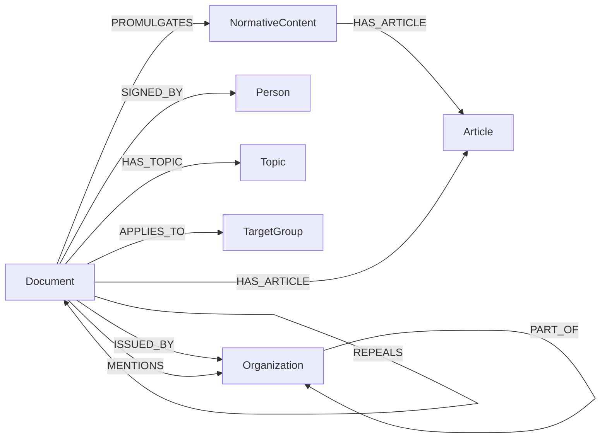
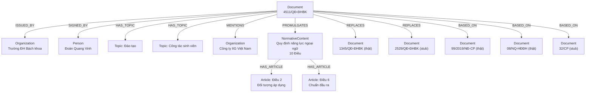
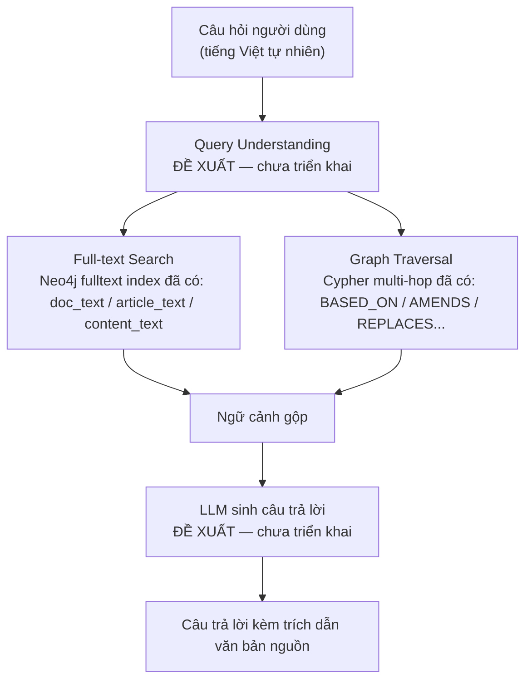

# Đồ thị tri thức pháp chế quản trị đại học — Báo cáo Knowledge Graph

Báo cáo kỹ thuật về kiến trúc, schema, số liệu thực tế và khả năng truy vấn
của knowledge graph Neo4j xây dựng cho việc tra cứu quan hệ hiệu lực và viện
dẫn giữa các văn bản pháp quy tại Đại học Đà Nẵng / Trường Đại học Bách
khoa. Mọi số liệu trong báo cáo lấy trực tiếp từ database đang chạy vào
ngày 21/09/2026 và từ mã nguồn `core/`, không suy đoán.

> Viết cho: giảng viên/cấp trên không trực tiếp tham gia implementation —
> không cần đọc code Neo4j vẫn hiểu được graph.

**Mục lục:** [1. Tổng quan](#1-tổng-quan-graph) · [2. Schema](#2-graph-schema) ·
[3. Node](#3-entity--node-definition) · [4. Relationship](#4-relationship-definition) ·
[5. Số liệu](#5-graph-statistics) · [6. Ví dụ thực tế](#6-example-subgraph--một-văn-bản-thật) ·
[7. Use case](#7-query--use-cases) · [8. AI / GraphRAG](#8-integration-với-ai--graphrag) ·
[9. Vấn đề & khuyến nghị](#9-design-issues--recommendations)

---

## 1. Tổng quan Graph

| Mục | Nội dung |
|---|---|
| Tên module | `src/legal_knowledge_graph` |
| Domain | Văn bản pháp quy trong quản trị đại học: nội quy/quy định/quy chế nội bộ của Trường Đại học Bách khoa & Đại học Đà Nẵng, cộng văn bản cấp Bộ Giáo dục & Đào tạo / Chính phủ / Quốc hội mà các văn bản nội bộ viện dẫn làm căn cứ. |
| Bài toán chính | Tra cứu **quan hệ hiệu lực và viện dẫn** giữa văn bản: văn bản nào dựa trên/sửa đổi/thay thế/bãi bỏ văn bản nào, chuỗi hiệu lực đó còn hợp lệ hay đã đứt đoạn. |
| Nguồn dữ liệu | 454 văn bản gốc được crawl/OCR thành text tại `data/clean/text_final/`, sau đó gán tay thành JSON có cấu trúc theo schema riêng (hỗ trợ Gemini API cho phần trích metadata), lưu tại `data/clean/json/v1/`. Bản đang nạp là `data/clean/json/v2/` — sao chép nguyên vẹn v1 cộng đúng một trường `document.targetGroups[]` (xem `data/clean/json/v2/README.md`). |
| Phạm vi hiện tại | 418/454 file JSON đã qua kiểm tra và được nạp (403 Document duy nhất sau khi gộp trùng số hiệu); 36 file còn lại nằm trong thư mục `_nghi_ngo/`, cố ý **chưa nạp** vì còn thiếu người ký hoặc thiếu Căn cứ. |
| Cập nhật gần nhất | Bộ dữ liệu thật đưa vào repo lần đầu 19/09/2026, có 2 lần sửa tiếp theo cùng tuần (bổ sung 95 trích dẫn bị bỏ sót, đọc lại 1 văn bản từ bản scan). 21/09: dựng lớp ứng dụng (NLQ + API + frontend). 22/09: bù `targetGroups` cho toàn kho thành `v2` và đo benchmark lần đầu (§5.1) — dữ liệu còn rất mới, đang tiếp tục hoàn thiện. |
| Vai trò Neo4j | Là **kho lưu trữ kiêm động cơ truy vấn** của module này. Từ 21/09/2026 đã có lớp ứng dụng bên trên: `core/nlq/` dịch câu hỏi tiếng Việt sang Cypher, `core/api/` phục vụ HTTP, `frontend/` là chat UI React — xem §8. Cypher trực tiếp (Neo4j Browser) và script kiểm thử Python vẫn dùng song song (§5, §7). |
| Đối tượng sử dụng | **Nhóm phát triển**, kiểm chứng qua Cypher/script. Đã có chat UI chạy được ở mức prototype (`run.py lkg serve-api` + `frontend/`, CORS chỉ mở cho Vite dev server local) nhưng **chưa triển khai** cho người dùng cuối thật — không suy đoán thêm ngoài phạm vi đã có trong code. |
| Vị trí kỹ thuật | Một **Neo4j instance riêng biệt hoàn toàn** (cổng, mật khẩu, docker container khác) so với pipeline trích xuất tự động đã có trong repo (`src/vanban/`) — quyết định kiến trúc có chủ đích, không dùng chung dữ liệu hay code (xem thêm §8). |

### Graph này giải quyết vấn đề gì mà một database/tìm kiếm văn bản thông thường khó làm hơn?

Một hệ tra cứu văn bản thông thường (tìm kiếm từ khoá, hoặc bảng SQL
"văn bản – số hiệu – ngày ban hành") trả lời tốt câu "văn bản nào chứa từ
X". Nhưng câu hỏi thật sự cần trong quản trị văn bản pháp quy luôn mang
tính **nhiều bước quan hệ**: "văn bản A dựa trên căn cứ nào, và những căn
cứ đó có văn bản nào đã bị thay thế/bãi bỏ chưa" là một chuỗi 2-3 bước qua
các văn bản khác nhau. Diễn đạt điều này bằng SQL đòi hỏi JOIN đệ quy phức
tạp và dễ sai; trong Cypher đây là một pattern `-[:AMENDS|REPLACES*1..5]->`
một dòng. Ngoài ra, một số câu hỏi gắn liền **bản chất đồ thị** của domain
— cơ quan cha/con (`PART_OF`), văn bản kèm theo bị thay thế theo dây
chuyền, tổ chức nào ban hành nhiều nhất — là những câu hỏi về *cấu trúc
quan hệ*, không phải về nội dung văn bản, nên graph biểu diễn đúng bản chất
bài toán hơn là một kho tài liệu phẳng.

---

## 2. Graph Schema

Toàn bộ node/relationship được lấy trực tiếp từ code nạp dữ liệu
(`core/graph_loader.py`, `core/graph_model.py`) và đối chiếu với database
đang chạy — không có node/relationship nào trong báo cáo này chưa tồn tại
trong code.

### 2.1 Node Labels

| Node | Ý nghĩa | Vai trò trong graph |
|---|---|---|
| `Document` | Một văn bản pháp quy (Luật, Nghị định, Thông tư, Quyết định, Công văn...). | Node trung tâm — mọi truy vấn nghiệp vụ đều xuất phát từ hoặc quy về Document. |
| `Organization` | Cơ quan/đơn vị: từ Quốc hội, Bộ GD&ĐT đến Phòng/Ban nội bộ trong trường. | Gắn văn bản với đơn vị ban hành/nhắc tới; dựng cây tổ chức qua `PART_OF`. |
| `Person` | Người ký văn bản. | Truy vết trách nhiệm ký ban hành. |
| `Topic` | Lĩnh vực nghiệp vụ (18 lĩnh vực cố định: Đào tạo, Tuyển sinh, Tài chính...). | Phân loại văn bản theo chủ đề để lọc/duyệt. |
| `TargetGroup` | Nhóm đối tượng áp dụng của văn bản (8 nhóm: Người học, Cán bộ-giảng viên, Đơn vị trực thuộc...). | Trả lời "văn bản nào áp dụng cho ai" — xem ghi chú phạm vi dữ liệu ở §5 và §9. |
| `NormativeContent` | Nội dung quy phạm kèm theo văn bản (một Quy định/Quy chế/Nội quy được "ban hành kèm theo" một Quyết định). | Tầng trung gian giữa Document và Article khi văn bản có cấu trúc kèm theo. |
| `Article` | Một Điều — đơn vị nội dung nhỏ nhất được lưu toàn văn. | Nơi chứa nội dung chi tiết để tra cứu/tìm kiếm full-text. |

### 2.2 Relationships

| Relationship | From → To | Ý nghĩa |
|---|---|---|
| `ISSUED_BY` | Document → Organization | Cơ quan đứng tên ban hành văn bản. |
| `SIGNED_BY` | Document → Person | Người ký văn bản. |
| `HAS_TOPIC` | Document → Topic | Văn bản thuộc lĩnh vực nào (nhiều-nhiều). |
| `APPLIES_TO` | Document → TargetGroup | Văn bản áp dụng cho nhóm đối tượng nào (nhiều-nhiều). |
| `MENTIONS` | Document → Organization | Tổ chức được nhắc tới trong thân văn bản, không phải bên ban hành/ký. |
| `PART_OF` | Organization → Organization | Quan hệ cấp trên-cấp dưới giữa các đơn vị (Phòng → Trường → Đại học vùng). |
| `PROMULGATES` | Document → NormativeContent | Văn bản "ban hành kèm theo" một Quy định/Quy chế. |
| `HAS_ARTICLE` | Document → Article **hoặc** NormativeContent → Article | Chứa một Điều cụ thể (Document dùng cho Điều "vỏ bọc"; NormativeContent dùng cho Điều bên trong nội dung kèm theo). |
| `BASED_ON` | Document → Document | Viện dẫn làm căn cứ pháp lý (khối "Căn cứ..." đầu văn bản). |
| `REFERENCES` | Document → Document | Nhắc tới một văn bản khác nhưng không thuộc 4 loại quan hệ hiệu lực còn lại. |
| `REPLACES` | Document → Document | Thay thế toàn bộ văn bản cũ. |
| `AMENDS` | Document → Document | Sửa đổi, bổ sung một phần của văn bản khác (có thể kèm `targetArticle`). |
| `REPEALS` | Document → Document | Bãi bỏ/huỷ bỏ toàn bộ hoặc một phần văn bản khác. |

13 loại relationship được định nghĩa trong code. Trên dữ liệu thật hiện
đang nạp, 12/13 loại có cạnh thật; `APPLIES_TO` có 0 cạnh trên data thật
(xem §5, §9) — cơ chế đã hoạt động và được minh chứng bằng 7 cạnh trên bộ
dữ liệu mẫu riêng (`samples/`, không tính vào phạm vi dữ liệu chính).

### 2.3 Hierarchy

Graph có 3 dạng phân cấp độc lập nhau:

- **Phân cấp nội dung văn bản:** `Document → (PROMULGATES) → NormativeContent
  → (HAS_ARTICLE) → Article` — dùng khi văn bản "ban hành kèm theo" một Quy
  định/Quy chế. Song song đó, `Document → (HAS_ARTICLE) → Article` áp dụng
  cho các Điều "vỏ bọc" nằm trực tiếp ở Quyết định (thường chỉ Điều 1
  "Ban hành kèm theo", Điều 2 "Hiệu lực", Điều 3 "Trách nhiệm thi hành")
  hoặc cho văn bản không có nội dung kèm theo (Luật, Nghị định). Hai nhánh
  này **tồn tại đồng thời** trong cùng một Document — đây là trường hợp phổ
  biến trong dữ liệu thật, không phải ngoại lệ (minh hoạ cụ thể ở §6).
- **Phân cấp tổ chức:** `Organization → (PART_OF) → Organization` — đơn vị
  cấp dưới trỏ tới đơn vị cấp trên trực tiếp (Phòng/Ban → Trường thành viên
  → Đại học vùng). 20 cạnh `PART_OF` hiện có trong dữ liệu thật.
- **Phân cấp thẩm quyền (thuộc tính, không phải cấu trúc node):** mỗi
  Document có một số nguyên `authorityLevel` (1–6, do `core/normalize.py`
  tự suy từ loại cơ quan ban hành rồi mới tới loại văn bản), thể hiện bậc
  hiệu lực pháp lý — Hiến pháp=6, Luật=5, Nghị định=4, Thông tư=3, cấp Đại
  học vùng=2, cấp trường thành viên=1. Đây không phải một quan hệ đồ thị mà
  là một giá trị xếp hạng dùng để lọc/so sánh.

### 2.4 Schema Diagram



7 node label, 13 relationship type — trích trực tiếp từ
`core/graph_loader.py`. Các cạnh Document→Document (hàng dưới) là nhóm
quan hệ hiệu lực/viện dẫn, trục giá trị chính của graph.

---

## 3. Entity / Node Definition

Property thật sự được ghi vào Neo4j (không phải tên field trong JSON đầu
vào — hai bên không luôn trùng tên).

| Node | Properties chính | Identifier | Ý nghĩa |
|---|---|---|---|
| `Document` | `documentNumber, title, documentType, status, issueDate, effectiveDate, expiryDate, summary, authorityLevel, isStub` | `normalizedNumber` | Văn bản "thật" (`isStub:false`) có đủ property trên. Văn bản "stub" (được trích dẫn nhưng chưa có JSON riêng) chỉ có 3 property: `normalizedNumber, documentNumber, isStub:true`. |
| `Organization` | `name, orgType` | `orgId` | `orgType` là 1 trong 8 giá trị chuẩn (quoc_hoi, chinh_phu, bo_nganh, dai_hoc_vung, truong_thanh_vien, don_vi_truc_thuoc, phong_ban...) — dùng để suy `authorityLevel` của Document. |
| `Person` | `fullName, academicTitle, position` (mảng) | `personId` | Một người có thể ký nhiều văn bản với chức danh khác nhau theo thời gian — `position` gộp tất cả chức danh đã ghi nhận. |
| `Topic` | `name` | `topicId` | 18 lĩnh vực cố định, nạp từ `reference/topics_seed.json` — vocabulary lấy nguyên từ danh mục lĩnh vực đã dùng ở pipeline tự động khác trong repo. |
| `TargetGroup` | `name` | `targetGroupId` | 8 nhóm đối tượng áp dụng, nạp từ `reference/target_groups_seed.json` — vocabulary tự thiết kế riêng cho module này (xem §9). |
| `NormativeContent` | `title, contentType, status` | `contentId` | `contentType` là 1 trong 9 giá trị (Quy định, Quy chế, Điều lệ, Nội quy...). `status` mặc định kế thừa từ Document cha nếu không ghi riêng. |
| `Article` | `number, heading, text, isImplementationClause` | `articleId` | `text` là toàn văn một Điều — property quan trọng nhất cho tìm kiếm full-text (`article_text` index). `isImplementationClause` đánh dấu Điều thuộc phần "Điều khoản thi hành". |

### Vì sao các node này cần tồn tại riêng biệt

**Document** và **Article** tách riêng vì đơn vị truy vấn khác nhau: có
câu hỏi ở mức toàn văn bản ("còn hiệu lực không"), có câu hỏi ở mức một
Điều cụ thể ("Điều nào quy định về miễn học phí") — gộp chung sẽ mất khả
năng full-text chính xác tới cấp Điều.

**NormativeContent** tồn tại như tầng trung gian vì thực tế văn bản pháp
quy Việt Nam thường có dạng "Quyết định ban hành kèm theo Quy định" — bản
thân Quyết định chỉ có 2-3 Điều thủ tục, nội dung chính nằm ở Quy định kèm
theo. Không có tầng này, không phân biệt được Điều "thủ tục" và Điều
"nội dung".

**Organization** tách khỏi Document (thay vì lưu tên cơ quan như một chuỗi
thuộc tính) vì cần dựng cây tổ chức (`PART_OF`) và tính `authorityLevel`
theo loại cơ quan — một chuỗi text không tra cứu được quan hệ cấp
trên/cấp dưới.

**TargetGroup** và **Topic** cùng là node "phân loại" tách khỏi Document để
một văn bản có thể gắn nhiều giá trị cùng lúc (nhiều-nhiều) và để đếm/xếp
hạng theo từng giá trị phân loại mà không cần quét toàn bộ text.

---

## 4. Relationship Definition

Knowledge Graph không chỉ là các node — phần thể hiện *kiến thức* thật sự
nằm ở các relationship. Đặc biệt, 5 relationship dưới cùng bảng (nhóm quan
hệ hiệu lực) trông giống nhau nhưng mang ý nghĩa pháp lý khác hẳn nhau;
gán sai loại sẽ khiến truy vấn "văn bản còn hiệu lực" cho kết quả sai.

| Relationship | From → To | Semantic meaning | Use case |
|---|---|---|---|
| `ISSUED_BY` | Document → Organization | Quan hệ hành chính: ai chịu trách nhiệm ban hành. | Lọc văn bản theo đơn vị. |
| `SIGNED_BY` | Document → Person | Quan hệ trách nhiệm cá nhân, tách khỏi `ISSUED_BY` vì một cơ quan có nhiều người có thẩm quyền ký theo từng thời kỳ. | Tra văn bản theo người ký. |
| `BASED_ON` | Document → Document | **Căn cứ pháp lý** — văn bản A viện dẫn văn bản B làm cơ sở thẩm quyền ban hành. Không hàm ý A sửa đổi hay chịu ảnh hưởng nội dung của B. | Truy vết nền tảng pháp lý; kiểm tra cơ sở ban hành có còn hiệu lực. |
| `REFERENCES` | Document → Document | **Nhắc tới thông thường** — mọi liên hệ không rơi vào 4 loại còn lại. Yếu nhất về ràng buộc pháp lý. | Gợi ý văn bản liên quan khi đọc. |
| `REPLACES` | Document → Document | **Thay thế toàn bộ** — văn bản đích coi như hết hiệu lực thực tế kể từ khi văn bản nguồn có hiệu lực. | Dò văn bản nào đang là "bản mới nhất" của một chính sách. |
| `AMENDS` | Document → Document | **Sửa đổi một phần** — văn bản đích vẫn còn hiệu lực tổng thể, chỉ một số Điều bị thay nội dung. Có thể kèm `targetArticle`. | Truy vết "phiên bản hiện hành" của một Điều cụ thể. |
| `REPEALS` | Document → Document | **Bãi bỏ** — khác `REPLACES` ở chỗ không có văn bản thay thế nội dung, hiệu lực đơn giản chấm dứt. | Loại văn bản đã bị bãi bỏ khỏi kết quả tra cứu. |
| `HAS_TOPIC` | Document → Topic | Phân loại theo lĩnh vực nghiệp vụ, độc lập với quan hệ hiệu lực. | Duyệt văn bản theo chủ đề. |
| `APPLIES_TO` | Document → TargetGroup | Phạm vi đối tượng chịu tác động của văn bản. | "Văn bản nào liên quan tới sinh viên" (xem lưu ý dữ liệu ở §9). |
| `MENTIONS` | Document → Organization | Nhắc tên tổ chức trong thân văn bản mà **không phải** bên ban hành/ký. | Tìm văn bản có liên quan hành chính tới một đơn vị. |
| `PART_OF` | Organization → Organization | Cấu trúc tổ chức (không liên quan văn bản). | Suy luận "bậc thẩm quyền mượn" cho đơn vị không có bậc riêng. |
| `PROMULGATES` / `HAS_ARTICLE` | Document → NormativeContent / (Document hoặc NormativeContent) → Article | Cấu trúc nội dung nội bộ văn bản, xem §2.3. | Truy vết toàn văn một Điều cụ thể. |

**Vì sao tách 5 loại quan hệ hiệu lực thay vì gộp chung một "LIÊN_QUAN"?**
Vì mỗi loại đòi hỏi cách xử lý khác nhau khi trả lời "văn bản này còn hiệu
lực không": `BASED_ON`/`REFERENCES` không ảnh hưởng hiệu lực của bên bị
trỏ tới; `REPLACES`/`REPEALS` chấm dứt hiệu lực; `AMENDS` chỉ thay đổi một
phần. Nếu gộp chung, không thể viết một truy vấn đúng cho câu hỏi pháp lý
thực tế — đây chính là lý do relationship type, không phải node, mới là
nơi "kiến thức nghiệp vụ" được mã hoá.

---

## 5. Graph Statistics

Số liệu chạy trực tiếp trên Neo4j (`bolt://localhost:7688`) sau khi nạp
toàn bộ 418 file JSON thật tại `data/clean/json/v2/`, đo lúc 22/09/2026.
Không dùng số liệu ước tính.

**Tổng quan:** 11.227 node · 17.410 relationship · 403 Document thật ·
996 Document stub · 8.814 Article · 778 Organization · 150 NormativeContent
· 60 Person.

So với lần đo 21/09 (nạp `v1/`): số node **không đổi**, số cạnh tăng
16.913 → 17.410 do 497 cạnh `APPLIES_TO` mới. Không một con số nào khác
xê dịch — đúng như kỳ vọng, vì v2 chỉ khác v1 ở một trường.

### Node theo nhãn

| Label | Số lượng |
|---|---:|
| Article | 8.814 |
| Document | 1.399 (403 thật + 996 stub) |
| Organization | 778 |
| NormativeContent | 150 |
| Person | 60 |
| Topic | 18 |
| TargetGroup | 8 |

### Relationship theo loại

| Relationship | Số lượng |
|---|---:|
| HAS_ARTICLE | 8.814 |
| MENTIONS | 3.593 |
| BASED_ON | 2.009 |
| HAS_TOPIC | 736 |
| ISSUED_BY | 405 |
| SIGNED_BY | 405 |
| REFERENCES | 346 |
| REPLACES | 187 |
| REPEALS | 185 |
| PROMULGATES | 150 |
| AMENDS | 63 |
| APPLIES_TO | 497 |
| PART_OF | 20 |

### Thống kê nghiệp vụ đáng chú ý (chỉ tính 403 Document thật)

| Chiều | Phân bố |
|---|---|
| Trạng thái hiệu lực | CON_HIEU_LUC: 381 · HET_HIEU_LUC: 1 · không rõ (null): 21 |
| Loại văn bản (top) | Quyết định 216 · Thông tư 76 · Nghị định 39 · Luật 35 · Công văn 16 · còn lại 21 |
| Bậc thẩm quyền (authorityLevel) | Bậc 5 (Luật): 36 · Bậc 4 (Nghị định): 40 · Bậc 3 (Thông tư/Bộ): 142 · Bậc 2 (Đại học vùng): 89 · Bậc 1 (trường thành viên): 95 · không suy được: 1 |
| Lĩnh vực nhiều văn bản nhất | Tổ chức, hành chính 202 · Đào tạo 125 · Pháp chế 76 · Tài chính, kế toán 50 · Công tác sinh viên 39 |
| NormativeContent theo loại | Quy định 86 · Quy chế 59 · Nội quy 2 · Quy trình 2 · Hướng dẫn 1 |
| Tổng cạnh quan hệ hiệu lực/viện dẫn | 2.790 (BASED_ON 2.009 + REFERENCES 346 + REPLACES 187 + REPEALS 185 + AMENDS 63) |
| Nhóm đối tượng áp dụng (`APPLIES_TO`) | Cơ quan/tổ chức/cá nhân liên quan 149 · Cơ sở giáo dục/trường thành viên 94 · Cán bộ, giảng viên, viên chức, NLĐ 87 · Đơn vị trực thuộc 86 · Người học 51 · Khác 14 · Doanh nghiệp/đối tác nước ngoài 12 · Hội đồng 4 |
| Độ sâu chuỗi `AMENDS`/`REPLACES` | 1 bước: 250 · 2 bước: 44 · 3 bước: 7 · 4 bước: 2 · không có chuỗi 5 bước |

Cypher dùng để lấy các số liệu trên:

```cypher
// Tổng theo nhãn
MATCH (n) RETURN labels(n)[0] AS label, count(*) AS total ORDER BY total DESC

// Tổng theo loại relationship
MATCH ()-[r]->() RETURN type(r) AS relType, count(*) AS total ORDER BY total DESC

// Document thật theo trạng thái hiệu lực
MATCH (d:Document {isStub: false}) RETURN d.status, count(*) ORDER BY count(*) DESC
```

---

## 5.1 Benchmark hiệu năng

17 câu Cypher trong `core/query/benchmark_catalog.py`, chạy bằng
`python run.py lkg query --source benchmark` trên đúng graph mô tả ở §5
(418 file `v2`, 11.227 node / 17.410 cạnh), đo lúc 22/09/2026.

`runner.py` chạy mỗi câu **hai lượt**: một lượt đo thời gian thật bằng
`time.perf_counter()`, một lượt `PROFILE` để đọc plan xem có dùng
index/fulltext hay bị quét toàn bộ.

| Câu | Nhóm | rows | elapsed_ms | index |
|---|---|---:|---:|:---:|
| B1_document_by_status | phân bố | 3 | 140,10 | – |
| B2_document_by_type | phân bố | 11 | 36,04 | – |
| B3_document_by_authority_level | phân bố | 6 | 51,30 | – |
| B4_normative_content_by_type | phân bố | 5 | 35,17 | – |
| B5_top_organizations | xếp hạng | 10 | 95,87 | – |
| B6_top_persons | xếp hạng | 10 | 64,77 | – |
| B7_top_topics | xếp hạng | 10 | 50,21 | – |
| B8_citation_relation_counts | lookup | 5 | 54,13 | N (WARN) |
| B9_amends_target_article_completeness | lookup | 2 | 38,76 | N (WARN) |
| B10_amends_replaces_depth_distribution | multihop | 4 | 132,25 | N (WARN) |
| B11_fulltext_doc_text | full-text | 50 | 212,49 | **Y** |
| B12_fulltext_article_text | full-text | 50 | 95,76 | **Y** |
| B13_fulltext_content_text | full-text | 50 | 134,01 | **Y** |
| B14_hybrid_expand_outgoing | hybrid | 50 | 486,12 | **Y** |
| B15_hybrid_expand_incoming | hybrid | 50 | 108,81 | **Y** |
| B16_top_cited_stubs | bất thường | 10 | 94,33 | – |
| B17_documents_without_citations | bất thường | 0 | 133,45 | – |

**Cách đọc bảng này.** Cột `assertion` mà `runner.py` in ra luôn là PASS và
**không mang thông tin gì** — mọi câu trong bộ này đặt `expected_rows=None`
nên không có gì để assert. Thứ có nghĩa là `elapsed_ms` và `index`.

Toàn bộ 17 câu dưới 500 ms. Chậm nhất là B14 (486 ms) — hybrid full-text
rồi mở rộng xuôi theo quan hệ, tức lượt truy vấn nặng nhất trong bộ, đúng
như hình dạng mong đợi. Cả 5 câu full-text/hybrid đều dùng đúng index
(`Y`), xác nhận 3 fulltext index (`doc_text`, `article_text`,
`content_text`) đang hoạt động.

**3 chữ `N (WARN)` là lỗi phân loại trong catalog, không phải vấn đề hiệu
năng.** B8 là `MATCH ()-[r]->()`, B9 là `MATCH ()-[r:AMENDS]->()`, B10 là
`MATCH p=(:Document)-[:AMENDS|REPLACES*1..5]->(:Document)` — cả ba đều quét
toàn bộ quan hệ, không có mệnh đề lọc theo property nên **về nguyên tắc
không thể** có `NodeIndexSeek`. Chúng đang mang `kind="lookup"`/`"multihop"`
nên `_index_used()` đòi tìm `indexseek` và báo WARN. Đổi sang
`kind="distribution"` là hết, vì kind đó trả `None` → in `–`.

**Giới hạn của bộ số này:** như `benchmark_catalog.py` tự ghi ở đầu file,
bộ 17 câu là **tự chọn để minh hoạ nhiều góc độ**, chưa được nhóm thẩm định
là đại diện đúng nhu cầu truy vấn thật. Số đo là thật; việc chọn hỏi câu
nào thì chưa qua thẩm định. Ngoài ra đây là số đo **một lần chạy, một máy,
graph vừa nạp xong** — không có warm-up, không lặp lại lấy trung vị, nên
đọc như một bức ảnh chụp hình dạng hiệu năng chứ đừng dùng để so sánh
chênh lệch vài chục ms giữa các câu.

---

## 6. Example Subgraph — một văn bản thật

Văn bản **`4511/QĐ-ĐHBK`** — "Quyết định Ban hành Quy định về yêu cầu năng
lực ngoại ngữ đối với sinh viên Trường Đại học Bách khoa" — lấy trực tiếp
từ database, không phải dữ liệu dựng minh hoạ.

| Property | Giá trị thật |
|---|---|
| `documentNumber` | 4511/QĐ-ĐHBK |
| `documentType` | Quyết định |
| `status` | CON_HIEU_LUC |
| `issueDate` | 2022-11-22 |
| `authorityLevel` | 1 (cấp trường thành viên) |
| `summary` | Quyết định ban hành Quy định về yêu cầu năng lực ngoại ngữ đối với sinh viên Trường Đại học Bách khoa, Đại học Đà Nẵng, bao gồm kiểm tra trình độ ngoại ngữ đầu vào, tổ chức giảng dạy, chuẩn ngoại ngữ sau mỗi năm học và chuẩn đầu ra khi tốt nghiệp. |

Văn bản này minh hoạ gần như đầy đủ các loại quan hệ trong schema: 1
`ISSUED_BY` (Trường ĐHBK), 1 `SIGNED_BY` (Hiệu trưởng), 2 `HAS_TOPIC`
(Đào tạo, Công tác sinh viên), 5 `MENTIONS` (trong đó có "Công ty IIG Việt
Nam" — đơn vị tổ chức thi TOEIC, được nhắc tới nhưng không ban hành/ký văn
bản), 1 `PROMULGATES` tới một NormativeContent 10 Điều, 3 Điều "vỏ bọc"
cấp Document, và đặc biệt **6 cạnh REPLACES + 9 cạnh BASED_ON** — thể hiện
đây là bản cập nhật thứ 6 của một chính sách đã tồn tại từ 2016.



Tập con thật của subgraph quanh 4511/QĐ-ĐHBK (đã rút gọn từ 33 cạnh trích
dẫn xuống các cạnh tiêu biểu để dễ đọc).

### Giải thích ngữ nghĩa

Chuỗi `REPLACES` cho thấy 4511/QĐ-ĐHBK là phiên bản mới nhất của quy định
năng lực ngoại ngữ, thay thế trực tiếp 1345/QĐ-ĐHBK (đã có JSON riêng,
"thật") và 5 quyết định cũ hơn từ 2016-2020 (hiện là "stub" — được nhắc
tới trong Căn cứ/thay thế nhưng chưa được gán tay thành file riêng). Nhóm
`BASED_ON` cho thấy văn bản dựa trên 2 tầng căn cứ: văn bản nội bộ
trường/đại học vùng (Nghị quyết Hội đồng trường/Hội đồng ĐHĐN) và văn bản
cấp Bộ (Thông tư 08/2021, 17/2021). Đây chính xác là dạng câu hỏi graph
trả lời tốt hơn tìm kiếm văn bản thường: "chuỗi 6 đời quyết định này"
không thể thấy được nếu chỉ tìm kiếm từ khoá trong từng văn bản riêng lẻ.

Cypher lấy đúng subgraph này:

```cypher
MATCH (d:Document {normalizedNumber: '4511/QD-DHBK'})
OPTIONAL MATCH (d)-[:ISSUED_BY]->(org:Organization)
OPTIONAL MATCH (d)-[:SIGNED_BY]->(signer:Person)
OPTIONAL MATCH (d)-[:HAS_TOPIC]->(topic:Topic)
OPTIONAL MATCH (d)-[cite]->(target:Document)
  WHERE type(cite) IN ['BASED_ON','REFERENCES','REPLACES','AMENDS','REPEALS']
OPTIONAL MATCH (d)-[:PROMULGATES]->(nc:NormativeContent)-[:HAS_ARTICLE]->(art:Article)
OPTIONAL MATCH (d)-[:MENTIONS]->(mentioned:Organization)
RETURN d, org, signer, topic, cite, target, nc, art, mentioned
```

---

## 7. Query & Use Cases

8 use case, chọn để phủ đủ các dạng truy vấn schema hỗ trợ: tra cứu 1
bước, multi-hop, căn cứ pháp lý, đảo chiều trích dẫn, phân loại đối tượng,
kết hợp full-text + đồ thị, và kiểm tra chất lượng dữ liệu. Toàn bộ Cypher
đã chạy thật trong bộ kiểm thử của module (`core/query/catalog.py`,
`benchmark_catalog.py`), không phải ví dụ lý thuyết.

### Use case 01 — Lookup

**Câu hỏi:** Văn bản nào do Trường ĐHBK ban hành và còn hiệu lực?
**Traversal:** `Document → ISSUED_BY → Organization`

```cypher
MATCH (d:Document)-[:ISSUED_BY]->(o:Organization {orgId: 'truong_dai_hoc_bach_khoa'})
WHERE d.status = 'CON_HIEU_LUC'
RETURN d.documentNumber, d.title
```

**Ý nghĩa:** lọc theo tổ chức + trạng thái trong một bước — việc một hệ tìm
kiếm văn bản phẳng cũng làm được, dùng làm baseline so sánh với các use
case multi-hop bên dưới.

### Use case 02 — Legal basis

**Câu hỏi:** Văn bản 4511/QĐ-ĐHBK dựa trên những căn cứ pháp lý nào, và
các căn cứ đó có còn hiệu lực?
**Traversal:** `Document → BASED_ON → Document`

```cypher
MATCH (d:Document {normalizedNumber: '4511/QD-DHBK'})-[:BASED_ON]->(base:Document)
RETURN base.documentNumber, base.status, base.isStub
```

**Ý nghĩa:** trả về đồng thời trạng thái hiệu lực và cờ "stub" của từng
căn cứ — phát hiện ngay căn cứ nào chưa có hồ sơ đầy đủ trong hệ thống
(isStub=true) để ưu tiên bổ sung.

### Use case 03 — Multi-hop

**Câu hỏi:** Chuỗi văn bản đã sửa đổi/thay thế nhau qua nhiều đời sâu tới
đâu?
**Traversal:** `Document -[AMENDS|REPLACES]-> Document` (1 tới 5 bước)

```cypher
MATCH path = (d:Document)-[:AMENDS|REPLACES*1..5]->(base:Document)
RETURN d.documentNumber, length(path) AS soBuoc, base.documentNumber
ORDER BY soBuoc DESC LIMIT 20
```

**Ý nghĩa:** đây là dạng câu hỏi **chỉ graph mới trả lời gọn được** — một
chuỗi "văn bản A sửa B, B từng thay thế C" đòi hỏi JOIN đệ quy nếu dùng
SQL. Trên data thật, chuỗi dài nhất đo được là 3 bước.

### Use case 04 — Đảo chiều trích dẫn

**Câu hỏi:** Văn bản nào đã thay thế văn bản cũ 2529/QĐ-ĐHBK?
**Traversal:** `Document ← REPLACES ← Document`

```cypher
MATCH (moi:Document)-[:REPLACES]->(:Document {normalizedNumber: '2529/QD-DHBK'})
RETURN moi.documentNumber
```

**Ý nghĩa:** quan hệ có hướng nên truy vấn "ai trích dẫn tới tôi" (đảo
chiều mũi tên) rẻ như truy vấn xuôi chiều — hữu ích khi tra một văn bản cũ
và muốn biết bản hiện hành thay thế nó là gì.

### Use case 05 — Cross-document, phân loại đối tượng

**Câu hỏi:** Văn bản nào áp dụng cho nhóm "Người học"?
**Traversal:** `Document → APPLIES_TO → TargetGroup`

```cypher
MATCH (d:Document)-[:APPLIES_TO]->(:TargetGroup {targetGroupId: 'nguoi_hoc'})
RETURN d.documentNumber
```

**Ý nghĩa:** trả về **51 văn bản** trên data thật (`v2`, đo 22/09/2026).
Trước 22/09 câu này trả 0 dòng vì `targetGroups` chưa được gán cho văn bản
thật nào — nạp `v1/` thì vẫn vậy. Nhóm đông nhất không phải "Người học" mà
là "Cơ quan, tổ chức, cá nhân có liên quan" (149), phản ánh việc phần lớn
văn bản cấp Bộ/Chính phủ dùng lối diễn đạt bao quát đó. Xem phân bố đầy đủ
ở §5.

### Use case 06 — Hybrid full-text + graph

**Câu hỏi:** Trong các văn bản khớp cụm "Đại học Đà Nẵng", văn bản nào dựa
trên các bậc thẩm quyền cao hơn?
**Traversal:** Fulltext index → `Document -[BASED_ON|REFERENCES*0..2]-> Document`

```cypher
CALL db.index.fulltext.queryNodes('doc_text', '"Đại học Đà Nẵng"') YIELD node, score
WITH node, score ORDER BY score DESC LIMIT 5
MATCH (node)-[:BASED_ON|REFERENCES*0..2]->(expanded:Document)
RETURN DISTINCT expanded.documentNumber, expanded.authorityLevel
ORDER BY expanded.authorityLevel DESC
```

**Ý nghĩa:** kết hợp điểm mạnh của 2 kỹ thuật — full-text (BM25 qua Lucene
tích hợp sẵn Neo4j) chọn ứng viên liên quan theo nội dung, rồi mở rộng
theo quan hệ để lấy ngữ cảnh pháp lý mà riêng full-text không thấy được.
Đây là nền tảng khái niệm cho GraphRAG ở §8.

### Use case 07 — Kiểm tra chất lượng dữ liệu

**Câu hỏi:** Văn bản thật nào (không phải stub) hiện chưa có trích
dẫn/căn cứ nào cả — có thể do gán thiếu?
**Traversal:** Document, đếm bậc-0 của 5 loại quan hệ hiệu lực

```cypher
MATCH (d:Document {isStub: false})
WHERE COUNT { (d)-[:BASED_ON|REFERENCES|REPLACES|AMENDS|REPEALS]->() } = 0
RETURN d.documentNumber, d.title
```

**Ý nghĩa:** dùng graph để tự-kiểm tra chất lượng gán tay — 0 dòng trả về
không phải lỗi, mà là dấu hiệu tốt (mọi văn bản thật đều có ít nhất 1 căn
cứ được ghi nhận).

### Use case 08 — Organization ranking

**Câu hỏi:** Đơn vị nào ban hành nhiều văn bản nhất trong kho dữ liệu?
**Traversal:** `Document → ISSUED_BY → Organization`, GROUP BY

```cypher
MATCH (d:Document {isStub: false})-[:ISSUED_BY]->(o:Organization)
RETURN o.name, count(d) AS soVanBan
ORDER BY soVanBan DESC LIMIT 10
```

**Ý nghĩa:** câu hỏi thống kê quản trị điển hình — đơn vị nào đang "sản
xuất" nhiều văn bản nội bộ nhất, hỗ trợ rà soát khối lượng công việc pháp
chế theo đơn vị.

---

## 8. Integration với AI / GraphRAG

> **CẬP NHẬT 21/09/2026 — phần lớn mục này đã lỗi thời.** Bản trước của
> báo cáo ghi "graph này KHÔNG có tích hợp AI/LLM/vector nào". Điều đó
> đúng tại thời điểm đó, nhưng `core/nlq/` + `core/api/` + `frontend/` đã
> hiện thực hoá đúng kiến trúc mà mục 8.1–8.4 đề xuất. Giữ lại phần đề
> xuất bên dưới để đối chiếu, và đánh dấu rõ chỗ nào đã có.

**Trạng thái hiện tại:** module có một lớp hỏi-đáp ngôn ngữ tự nhiên chạy
được, hai tầng:

- **Stage A — template.** `core/nlq/match_template.py` đưa câu hỏi cho
  Gemini chọn 1 trong **14 template Cypher viết tay**
  (`core/nlq/templates.py`) và trích tham số thô. Tham số đi qua
  `core/nlq/resolve.py` để khớp về thực thể thật (tổ chức, số hiệu, lĩnh
  vực, nhóm đối tượng, trạng thái). Không khớp rõ ràng thì ném
  `ResolutionFailed` và **không chạy Cypher nào**.
- **Stage B — freeform.** Khi Stage A dưới ngưỡng tin cậy
  (`LKG_NLQ_TEMPLATE_CONFIDENCE_MIN`, mặc định 0,6), `core/nlq/freeform.py`
  để Gemini tự viết Cypher. Cypher đó **bắt buộc** qua `core/nlq/guard.py`:
  blocklist ghi (`CREATE`/`MERGE`/`SET`/`DELETE`/`apoc.*`/`gds.*`),
  whitelist label + property, chặn multi-statement, `EXPLAIN` dry-run, ép
  `LIMIT`. Lý do guard nằm ở tầng code chứ không ở DB được ghi rõ trong
  file: Neo4j Community không có RBAC.

`ask()` luôn trả đúng một trong bốn loại kết quả — `template_result`,
`freeform_result`, `resolution_failed`, `unsupported` — không bao giờ trộn
"0 dòng hợp lệ" với "bị từ chối".

Vẫn **chưa có** vector database/embedding. Retrieval hiện dựa hoàn toàn
vào 3 fulltext index của Neo4j + multi-hop Cypher, đúng như bảng ở 8.1–8.4
mô tả.

**Kiểm chứng:** `python run.py lkg nlq-eval` chạy bộ 19 câu gold thật qua
Gemini + Neo4j (không mock), assert đúng LOẠI kết quả và tên template —
18/18 câu có assert PASS, đo 22/09/2026. Bộ gold phủ đủ 14/14 template,
cộng 1 ca resolution thất bại, 1 ca ngoài schema, 1 ca yêu cầu ghi/xoá giả
danh câu hỏi (phải bị guard chặn), 1 ca ép rơi xuống Stage B thật.

**Hạn mức API là ràng buộc vận hành thật.** Free tier của
`gemini-3.6-flash` chặn ở 20 request/ngày/project/model. Lượt chạy
`nlq-eval` đầu tiên bằng một key duy nhất cháy quota giữa chừng và FAIL 3
câu cuối vì 429 — không phải lỗi logic. `core/nlq/gemini_client.py` sau đó
được đổi sang bể key xoay vòng (`config.nlq_gemini_keys()`), và lượt chạy
lại đạt 18/18.

### 8.0 Bối cảnh: một pipeline RAG khác đã tồn tại trong cùng repo, nhưng KHÔNG kết nối với graph này

Repo có một pipeline trích xuất tự động khác (`src/vanban/`) sở hữu Neo4j
riêng, và đã cài đặt sẵn 3 cơ chế truy hồi (BM25 qua full-text index của
Neo4j, KG-based, và Hybrid — trong `src/vanban/rag/engines.py`). Đây là
một hệ thống **khác hoàn toàn**: instance Neo4j khác (cổng, mật khẩu
khác), schema property đặt tên khác (tiếng Việt không dấu, ví dụ
`so_hieu_norm` thay vì `normalizedNumber`), và có chủ đích **không chia sẻ
code/dữ liệu** với graph mô tả trong báo cáo này — quyết định kiến trúc
được ghi nhận rõ trong tài liệu của cả hai module. Vì vậy các mục 8.1–8.4
dưới đây mô tả **kiến trúc đề xuất riêng cho graph này**, không phải mô tả
lại hệ thống RAG đã có sẵn ở nơi khác trong repo.

### 8.1–8.4 Kiến trúc đề xuất — PHẦN LỚN ĐÃ TRIỂN KHAI

Kiến trúc đề xuất ban đầu, giữ nguyên để đối chiếu. Khối "Query
Understanding" và "LLM" nay đã có thật (`core/nlq/`); chỉ còn vector
database là chưa.



Sơ đồ trên vẽ theo bản đề xuất; hai khối ghi "ĐỀ XUẤT" nay đã được cài
đặt trong `core/nlq/`.

| Thành phần | Trạng thái | Vai trò |
|---|---|---|
| Neo4j (graph này) | **Đã có** | Lưu entity + quan hệ, cung cấp multi-hop retrieval (chuỗi hiệu lực, căn cứ pháp lý) và full-text search qua 3 index sẵn có — 2 năng lực một vector database đơn thuần không có. |
| Query Understanding / Router | **Đã có** | `core/nlq/match_template.py` — Gemini chọn template + trích tham số; dưới ngưỡng tin cậy thì router hạ xuống Stage B. Thay cho việc người viết Cypher tự chọn (§7). |
| LLM | **Đã có** | Diễn giải câu hỏi tự nhiên thành template + tham số (Stage A) hoặc thẳng ra Cypher (Stage B). **Chưa** dùng LLM để tổng hợp câu trả lời văn xuôi — `ask()` trả về rows thô kèm Cypher đã chạy. |
| Lớp an toàn cho Cypher do LLM sinh | **Đã có** | `core/nlq/guard.py` — blocklist ghi, whitelist label/property, `EXPLAIN` dry-run, ép `LIMIT`. Không có trong bản đề xuất ban đầu; cần thêm vì Neo4j Community không có RBAC. |
| API + giao diện | **Đã có** | `core/api/app.py` (FastAPI, 2 endpoint) + `frontend/` (React 19 + Vite). Prototype: CORS chỉ mở cho Vite dev server local. |
| Vector database / embedding | **Chưa có** | Nếu thêm, sẽ phụ trách tìm đoạn văn bản gần nghĩa (semantic similarity) khi câu hỏi không trùng từ khoá chính xác — bù cho hạn chế của full-text Lucene hiện tại (khớp từ, không khớp ngữ nghĩa). |

**Vì sao kết hợp Graph + Vector/Full-text thay vì chỉ dùng một phương pháp
(nếu triển khai):** full-text/vector tốt cho "tìm đoạn văn bản gần nghĩa
với câu hỏi" nhưng không tự nhiên trả lời "văn bản này có còn hiệu lực
không" — cần đi theo chuỗi REPLACES/REPEALS. Ngược lại, graph traversal
cần biết điểm bắt đầu (node nào) — đây chính là việc full-text/vector
search làm tốt. Hai kỹ thuật bù trừ cho nhau, không thay thế nhau —
nguyên lý này đã áp dụng được ngay hôm nay ở mức Cypher thủ công (Use
case 06, §7), trước khi cần bất kỳ LLM nào.

---

## 9. Design Issues / Recommendations

Các vấn đề dưới đây được liệt kê để lưu hồ sơ và cân nhắc — báo cáo
**không tự sửa schema/dữ liệu** khi phát hiện.

### 14 nhóm số hiệu văn bản bị trùng — đã soi kỹ 2 nhóm, cả 2 đều vô hại (đã sửa nhận định trước đó)

Cơ chế nạp dùng `normalizedNumber` làm khoá hợp nhất — khi 2 file JSON có
cùng số hiệu chuẩn hoá, Neo4j `MERGE` gộp chúng thành 1 Document node
(quan hệ vẫn giữ đủ từ cả 2 file, nhưng property phẳng bị ghi đè theo thứ
tự đọc). Trên data thật hiện có 14 nhóm như vậy (29 file).

Một bản nháp trước của báo cáo này từng nghi 2 nhóm — `771/QĐ-ĐHBK` và
`05/NQ-HĐT` — là gộp nhầm 2 văn bản khác nhau, chỉ dựa trên so sánh
title/summary trong JSON. Soi lại tận gốc (đọc thẳng file `.txt` nguồn,
trước cả bước gán tay) thì **cả 2 nhóm đều vô hại**:

- `05/NQ-HĐT` (3 file): cả 3 file `.txt` gốc giống hệt nhau (cùng tiêu đề,
  cùng ngày, cùng 51 Điều) — 3 người gán tay độc lập cùng một văn bản
  thật, mỗi người bắt được một tập trích dẫn khác nhau (8/12/10 câu). Gộp
  lại **có lợi** — cộng dồn đủ 30 trích dẫn thay vì chỉ 8-12 nếu giữ
  riêng.
- `771/QĐ-ĐHBK` (2 file): cả 2 file `.txt` gốc cùng nội dung "Quy trình
  xây dựng kế hoạch và dự toán kinh phí hoạt động" (chỉ khác biệt nhỏ do
  OCR 2 lần) — JSON phản ánh đúng những gì thật sự có trong file `.txt`
  nó nhận được, không phải lỗi gán tay.

12 nhóm còn lại trong 14 nhóm chưa được soi kỹ từng nhóm — không có bằng
chứng chúng có vấn đề, nhưng cũng chưa xác nhận từng cái. Field
`idOverride` vẫn có sẵn trong schema cho trường hợp thật sự cần tách 2 văn
bản khác nhau trùng số hiệu, nếu phát hiện sau này.

### Một văn bản thật đã mất khỏi kho crawl, bị thay bằng bản sao của văn bản khác

Phát hiện khi soi `771/QĐ-ĐHBK`: file `data/clean/text_final/.../0049_771_
QĐ-ĐHBK_Quy chế làm việc của Phòng Thí nghiệm và Xưởng thực hành, thực
tập.txt` — tên file nói về "Phòng Thí nghiệm và Xưởng thực hành" nhưng nội
dung **bên trong** file lại là bản sao (không giống hệt do OCR 2 lần) của
văn bản "Quy trình xây dựng kế hoạch và dự toán kinh phí hoạt động" —
đúng nội dung của file 0048 bên cạnh nó. Grep toàn bộ 454 file `.txt`
trong kho không tìm thấy nội dung thật về "Phòng Thí nghiệm và Xưởng thực
hành" ở bất kỳ đâu — văn bản này **coi như chưa từng được crawl đúng vào
kho**, không phải bị gộp nhầm trong graph. Đây là lỗi ở khâu thu thập dữ
liệu gốc (`data/clean/text_final/`), **không phải lỗi của
`legal_knowledge_graph` hay của người gán JSON** — JSON 0049 phản ánh
trung thực (dù trùng lặp) nội dung file `.txt` nó thật sự nhận được. Việc
sửa (tìm và crawl lại đúng văn bản gốc) thuộc về khâu thu thập dữ liệu,
ngoài phạm vi module này.

### ~~Field `targetGroups`/`APPLIES_TO` 0% dữ liệu thật~~ — ĐÃ XỬ LÝ 22/09/2026

Đã bù cho toàn kho, kết quả ở `data/clean/json/v2/`: **268/454 văn bản có
nhãn**, sinh 497 cạnh `APPLIES_TO` trên 418 văn bản được nạp. 186 file
mang `[]`, và đó là **kết luận chứ không phải thiếu sót** — cả văn bản
không có mục nào nói về đối tượng áp dụng (đa số là Quyết định ban hành
kèm theo, Công văn, Kế hoạch, và Luật chỉ có "Phạm vi điều chỉnh").

**Nguyên nhân gốc không phải "gán tay còn tồn đọng" như bản trước ghi.**
`PROMPT` sinh JSON (`tools/gemini_web/cau_json.py`) chưa bao giờ liệt kê
`targetGroups` trong khối `CẤU TRÚC`, lại chốt "khoá nào không có trong
danh sách này thì TUYỆT ĐỐI không được thêm" — model bị **cấm** sinh
trường đó, nên 0/418.

Cách bù: `python tools/gemini_api/chay_json.py --bu-nhom`. Mode này cắt
đoạn "Phạm vi điều chỉnh / đối tượng áp dụng" từ `.txt` gốc (trần 2,6 KB
thay vì cả văn bản ~29 KB), hỏi model đúng một câu, rồi ghi **đúng một
khoá** sang v2. Không sinh lại file — nếu sinh lại thì model viết đè
`citations`/`summary`/`signers`, làm mất 95 trích dẫn đã bù tay ở commit
`0befcd4` và bản `0196` đọc lại từ scan ở `7fd667c`.

**Còn lại cần rà tay:** 16 văn bản mang nhãn `Khác` (6% của 268), trong
khi `target_groups_seed.json` ước vocabulary phủ 98% (≈5 file). Và bộ cắt
chỉ nhận đúng cụm "đối tượng áp dụng", nên bỏ sót **7 văn bản** tuyên bố
đối tượng bằng lối khác ("Quy chế này áp dụng cho toàn thể CCVC-NLĐ…"):
`0101` `0196` `0083` `0186` `0107` `0300` `0144`.

### `targetArticle` trên cạnh AMENDS là thuộc tính mô tả, không phải cạnh tới node Article

Khi một văn bản sửa đổi "Điều 5" của văn bản khác, thông tin "Điều 5" chỉ
được lưu như một chuỗi thuộc tính trên cạnh `AMENDS`, không resolve thành
một cạnh riêng trỏ đúng tới node `Article` tương ứng. Đây là cắt phạm vi
có chủ đích ở v1, nhưng có nghĩa hiện tại không truy vấn được trực tiếp
"những Điều cụ thể nào đã từng bị sửa" ở cấp độ node.

### 36/454 văn bản đã thu thập nhưng chưa nạp vào graph

Thư mục `_nghi_ngo/` chứa 36 file JSON đã qua được JSON Schema nhưng còn
cảnh báo thiếu người ký hoặc thiếu khối "Căn cứ" — cố ý loại khỏi lần nạp
hiện tại cho tới khi được rà lại thủ công. Phạm vi dữ liệu ở §1/§5 vì vậy
là 92% (418/454) kho văn bản đã thu thập, không phải 100%.

### ~~Chưa có lớp truy vấn ngôn ngữ tự nhiên~~ — ĐÃ XỬ LÝ 21/09/2026

`core/nlq/` dịch câu hỏi tiếng Việt sang Cypher (14 template + fallback
freeform có guard), `core/api/` phục vụ HTTP, `frontend/` là chat UI
React. Xem §8. Cypher trực tiếp vẫn là đường dùng chính của nhóm phát
triển.

**Hạn chế còn lại:** `ask()` trả về **rows thô** kèm Cypher đã chạy, chưa
có bước LLM tổng hợp thành câu trả lời văn xuôi có trích dẫn — tức mới
giải quyết vế "không cần biết viết Cypher", chưa giải quyết vế "đọc hiểu
ngay kết quả". Ngoài ra chat UI mới ở mức prototype: CORS chỉ mở cho Vite
dev server local, chưa có xác thực, chưa giới hạn tần suất.

---

*Báo cáo tạo ngày 21/09/2026, cập nhật 22/09/2026, dựa trên trạng thái
database và mã nguồn thực tế tại thời điểm đó trong
`src/legal_knowledge_graph`. Mọi số liệu thống kê có thể thay đổi khi dữ
liệu được cập nhật thêm.*

*Lượt cập nhật 22/09 chạm vào: §1 (nguồn dữ liệu v1 → v2, vai trò Neo4j,
đối tượng sử dụng), §5 (đo lại trên v2 — số cạnh 16.913 → 17.410),
§5.1 (MỚI — bảng benchmark 17 câu), §7 Use case 05 (0 → 51 dòng), §8
(GraphRAG: từ "chưa triển khai" sang đã có `core/nlq/`), §9 (hai mục
`targetGroups` và "chưa có NLQ" chuyển sang ĐÃ XỬ LÝ). Số liệu đo bằng
`run.py lkg all --dir data/clean/json/v2` rồi
`run.py lkg query --source benchmark`, trên máy Windows 11, Neo4j 5 trong
Docker, một lần chạy duy nhất không warm-up.*
